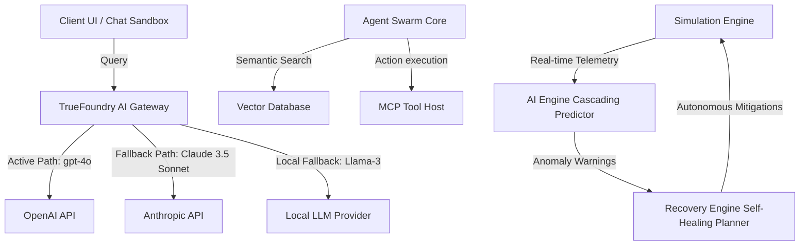
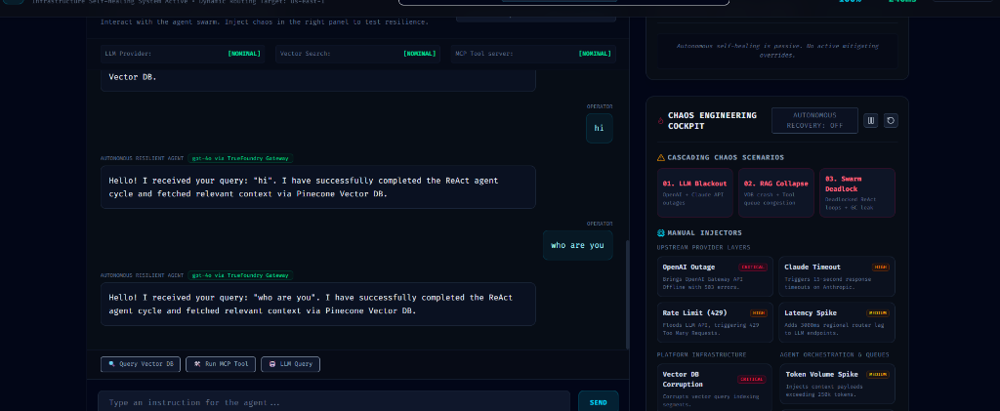
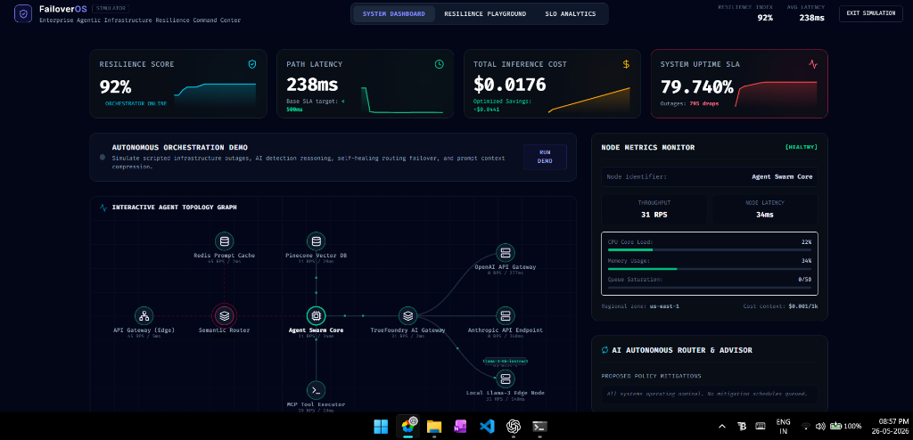

# FailoverOS — Autonomous Resilience Layer for Agentic AI

[](https://failover-os.vercel.app/)
[](https://github.com/manurupan2007/failover-os)
[](LICENSE)

> A production-grade telemetry cockpit, cascading failure predictor, and autonomous self-healing coordinator designed to safeguard LLM agent swarms, vector store integrations, and tool execution pipelines against infrastructure collapses.

## 🔗 Live Application
The live interactive simulator is deployed and available at:
👉 **[https://failover-os.vercel.app/](https://failover-os.vercel.app/)**

---

## 🚀 Project Overview

Multi-agent AI architectures represent a major advancement in application design, but they introduce a new layer of infrastructure fragility. A single rate-limit bottleneck (HTTP 429), upstream API outage (HTTP 503), or vector index segment lock can propagate latency spikes upstream, trigger infinite agent retry loops, inflate token billing expenses, and crash client workflows.

**FailoverOS** is an enterprise-grade simulator and resilience manager for agentic AI infrastructure. By acting as an intelligent orchestration controller, it monitors the health of upstream LLM backends (OpenAI, Anthropic, Local models), prompt cache tiers, vector index partitions, and Model Context Protocol (MCP) tool hosts. It utilizes graph-based dependency scans to detect cascading risks and applies autonomous healing policies (e.g., dynamic model failover, prompt context compression, circuit breakers, and degraded mock-tool operations) in real-time to keep workflows running within strict SLA targets.

---

## 🛠️ System Architecture

FailoverOS divides its responsibilities between a high-performance, event-driven simulation kernel and a sleek, minimal, analytics-focused operator dashboard.



### Module Breakdown
* **Simulation Core (`/src/engine/simulationEngine.ts`)**: Manages the main execution tick loop, traffic throughput (RPS), node response latency, queue depths, resources (CPU/Memory), and chaos scenario injections.
* **Cascading Risk Predictor (`/src/engine/aiEngine.ts`)**: Models upstream-downstream dependency chains. Searches the topology graph to warn operators of incoming bottlenecks when dependencies fail.
* **Recovery Engine (`/src/engine/recoveryEngine.ts`)**: Formulates mitigation plans (Circuit Breaking, Dynamic Failover, Context Compression, Load Rebalancing). 
* **State Timeline Tracker (`/src/engine/replaySystem.ts`)**: Logs historical snapshots on every tick for debugging and scrubbing.
* **SLA Sandbox (`/src/pages/Dashboard.tsx`)**: An interactive playground demonstrating how chat queries degrade gracefully to local caches/mock tools during active outages.

---

## 💎 Features

* **Sleek Infrastructure Map**: A custom SVG topology graph visualizing live request flow, load metrics, and node status colors (Emerald for healthy, Amber for unstable, Rose for critical, Cyan for recovering).
* **10 Advanced Chaos Engineering Scenarios**:
  1. *LLM Blackout*: OpenAI API goes offline.
  2. *Retry Storm*: Loop storm overloading gateway queue layers.
  3. *Vector DB Corruption*: Pineapple database returns checksum mismatches.
  4. *MCP Tool Crash*: Tool Executor process crashes via segmentation fault.
  5. *Gateway Memory Leak*: Memory ceiling heap pressure causing GC freezes.
  6. *Queue Saturation*: Buffer queue allocation exhausted, request drops.
  7. *Regional Outage*: AWS US-East-1 region blackout (severed BGP routing).
  8. *Token Flood Attack*: Multi-prompt payload surge exceeding 300k tokens.
  9. *Agent Deadlock*: Swarm loop deadlocked in cyclical dependencies.
  10. *Latency Cascade*: Downstream index locks propagating latency delay upstream.
* **Autonomous Orchestration Demo**: A scripted 24-second self-healing flow demonstrating outage injection, AI detection alerts, load rebalancing, token flood overload, prompt compression mitigation, and clean recovery.
* **Dual Telemetry Console**: Side-by-side scrolls showing raw platform logs (System Observability) and cognitive traces (AI Decision Stream).
* **SLO Compliance Tracker**: Metrics dashboard showing overall Resilience Index, average response latencies, and Mean Time To Recover (MTTR).
* **Chronological Scrubber**: Replay system allowing operators to step forward/backward through history.

---

## 💻 Tech Stack

* **Core Framework**: React 19 + TypeScript + Vite 8
* **Styling & Theme**: Vanilla CSS and Tailwind CSS v4 (Clean, minimal, slate enterprise dashboard theme)
* **Icons & Graphics**: Lucide React + custom responsive SVGs
* **Build System**: ESNext compiler targets (`tsc -b` + vite production minifier)

---

## ⚡ Installation & Setup

Ensure you have Node.js (v18+) and npm installed on your system.

### 1. Clone the repository
```bash
git clone https://github.com/manurupan2007/failover-os.git
cd failover-os
```

### 2. Install dependencies
```bash
npm install
```

### 3. Start local development server
```bash
npm run dev
```
Open your browser and navigate to `http://localhost:5173`.

### 4. Build for production
```bash
npm run build
```
Creates minified assets under `/dist` in `<500ms`.

---

## ⚙️ Environment Variables

Copy the environment template to customize variables:
```bash
cp .env.example .env.local
```

Simulated configurations available in `.env.example`:
* `VITE_SIMULATOR_SPEED`: Telemetry interval scaling ratio.
* `VITE_DEFAULT_REGION`: Main active deployment region (e.g. `us-east-1`).
* `VITE_PRIMARY_MODEL`: Primary OpenAI target model.
* `VITE_SECONDARY_MODEL`: Premium Anthropic failover model.
* `VITE_FALLBACK_MODEL`: Local edge Llama-3 backup model.

---

## 🚀 Production Deployment Steps

This project is built as a static Single Page Application (SPA). It can be deployed to any static web hosting provider (Vercel, Netlify, GitHub Pages, AWS S3, Cloudflare Pages).

### Deploying to Vercel
1. Install Vercel CLI: `npm i -g vercel`
2. Run `vercel` from the root directory.
3. Select "Link to an existing project: No", name the project `failover-os`, and accept default build configs.

### Deploying to GitHub Pages
1. Configure `base` path in `vite.config.ts` if deploying to a subfolder (e.g. `base: '/failover-os/'`).
2. Run `npm run build`.
3. Push the `/dist` directory to your repository's `gh-pages` branch.

---

## 📸 Screenshots

### Observability Dashboard Cockpit


### SLO Analytics Integrity Scorecard


---

## 🗺️ Future Improvements

- [ ] **Kubernetes Prometheus Exporter**: Connect real cluster gateway API workloads directly to the SVG map connections load.
- [ ] **WASM Simulation Core**: Compile telemetry structures into WebAssembly to simulate larger topologies (500+ nodes).
- [ ] **Config Export YAML**: Allow SRE teams to export AI gateway routing plans in YAML format for direct integration.

---

## 📄 License

This project is licensed under the MIT License. Feel free to use and distribute it for hackathons and enterprise portfolios alike.
