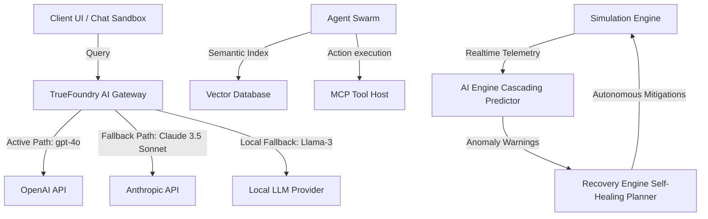

# FailoverOS — Autonomous Resilience Layer for AI Infrastructure

> A deep-tech infrastructure intelligence cockpit, failure prediction engine, and autonomous self-healing planner designed to safeguard LLM agent workflows and microservice topologies against cascading outages. Built for the **TrueFoundry Resilient Agents Challenge** at AI DevSummit 2026.

---

## 🚀 Overview

LLM-based multi-agent systems represent a shift in software engineering, yet they remain vulnerable to the fragility of external APIs, vector store indices, tool-execution engines, and local host processes. A single rate-limit error, upstream latency spike, or vector database connection timeout can trigger retry storms, locking agent execution loops, inflating token usage, and stalling critical customer workflows.

**FailoverOS** acts as a self-healing middleware and visual simulation environment for AI infrastructure. It monitors the health of upstream LLM providers, vector stores, and Model Context Protocol (MCP) host servers, models cascading failure vectors, and executes autonomous self-healing policies (e.g., fallback model routing, Pinecone circuit breakers, context prompt compression, and static agent execution fallback states) in real-time before outages breach SLAs.

### Why It Matters
* **Saves Customer Workflows**: Prevents agent loops from crashing when external endpoints return 503 or 429 status codes.
* **Eliminates Billing Spikes**: Auto-rebalances traffic away from congested routes, avoiding token wastage in infinite retry storms.
* **Proves Self-Healing**: Includes an interactive **SLA Resilience Sandbox** demonstrating how chat queries gracefully degrade from nominal state to cache fallback without breaking client-side UX.

---

## 🛠️ System Architecture

FailoverOS is split into a high-performance simulation core (operating on an immutable telemetry snapshot cycle) and a Vercel/Linear-inspired React HUD dashboard.



### Module Breakdown
* **Telemetry Core (`/src/engine/simulationEngine.ts`)**: Manages the main execution tick loop, flow parameters (RPS/latency), queue depths, and chaos scenarios. Evaluates connection links and pushes telemetry snapshots.
* **Cascading Risk Predictor (`/src/engine/aiEngine.ts`)**: Inspects node relations. Uses graph-based BFS path searches to estimate time-to-outage (TTO) when upstream hubs stall, warning operators of imminent queue blockages.
* **Recovery Orchestrator (`/src/engine/recoveryEngine.ts`)**: Generates mitigation blueprints (Failovers, Circuit Breaking, Context Compression, Load Rebalancing). In autonomous mode, policies are applied instantly.
* **Interactive Sandbox (`/src/pages/Dashboard.tsx`)**: Integrates chat execution logs with active simulation metrics. Enables visual testing of graceful client degradation in real-time.

---

## 💎 Features

* **Interactive Topology Map**: Custom SVG nodes-and-connections canvas showing active traffic load flowing through particle flows. Features live hover metrics and responsive SVG scaling ratios.
* **11 Chaos Engineering Injectors**: Inject upstream rate limits, memory leaks, agent deadlocks, API outages, database corruptions, and MCP process crashes.
* **Pre-Configured Scenarios**: Trigger multi-stage outages (e.g., "LLM Blackout" or "RAG Collapse") to observe cascading queue saturation.
* **Dynamic SLA Scorecard**: Monitors uptime SLAs, response target latencies, and average Time-To-Recover (MTTR) against strict compliance targets.
* **Chronological Scrubber Replay**: Full playback console allowing developers to step backward and forward through historical snapshots to debug outages.

---

## 💻 Tech Stack

* **Core Framework**: React 19 + TypeScript + Vite 8
* **Styling & Theme**: Tailwind CSS v4 (Sleek, dark, glassmorphic HUD style)
* **Icons & Assets**: Lucide React + custom inline SVG matrices
* **Build toolchain**: ESNext compiler targets (`tsc -b` compiling in <500ms)

---

## 📂 Project Directory Structure

FailoverOS adheres to a scalable, organized folder architecture:

```text
failover-os/
├── public/                  # Static assets and SVG icons
│   ├── favicon.svg          # Custom brand favicon
│   └── icons.svg            # Graphic layout elements
├── src/
│   ├── assets/              # Static media files (e.g., logo images)
│   ├── components/
│   │   ├── common/          # Reusable shell & error boundaries
│   │   │   ├── ErrorBoundary.tsx
│   │   │   └── LoadingScreen.tsx
│   │   └── dashboard/       # Dashboard telemetry HUD widgets
│   │       ├── AlertStream.tsx
│   │       ├── AnalyticsPage.tsx
│   │       ├── ChaosPanel.tsx
│   │       ├── MetricsPanel.tsx
│   │       ├── ReplayCenter.tsx
│   │       └── TopologyGraph.tsx
│   ├── engine/              # Core business simulation kernels
│   │   ├── aiEngine.ts      # Graph failure propagation and BFS warnings
│   │   ├── recoveryEngine.ts# Mitigation planning and autonomous policies
│   │   ├── replaySystem.ts  # Timeline state snapshot tracking
│   │   ├── simulationEngine.ts # Telemetry tick loop and chaos handlers
│   │   └── types.ts         # Strictly-typed schemas and interfaces
│   ├── pages/               # Page layouts
│   │   ├── LandingPage.tsx  # Hero portal for AI DevSummit 2026
│   │   └── Dashboard.tsx    # Operations Control Room & Chat Sandbox
│   ├── App.tsx              # Routing and primary simulation state manager
│   ├── main.tsx             # DOM mounting and ErrorBoundary wrapper
│   └── index.css            # Base Tailwind v4 styles and font configs
├── index.html               # Main HTML wrapper (SEO meta tagged)
├── vite.config.ts           # Development server configs
└── tsconfig.json            # Strict TypeScript configuration
```

---

## ⚡ Installation & Setup

Follow these steps to run FailoverOS locally:

### 1. Clone the repository
```bash
git clone https://github.com/manurupan2007/failover-os.git
cd failover-os
```

### 2. Install dependencies
Ensure you have Node.js (v18+) and npm installed.
```bash
npm install
```

### 3. Start the dev server
Run the development environment locally:
```bash
npm run dev
```
Open your browser and navigate to `http://localhost:5173`.

### 4. Build for production
To build and optimize files for deployment (creates production bundle under `/dist` in <500ms):
```bash
npm run build
```

---

## 🧠 Engineering & Design Decisions

### 1. High-Performance Snapshot Copying (Zero GC Pressure)
Rather than executing expensive `JSON.parse(JSON.stringify(...))` chains on every 1-second simulation tick (which causes garbage collector latency and frame-drops over extended periods), we implemented a structural `.map()` mapping system. Only the mutable reference fields (`nodes` and `connections`) are cloned during telemetry captures, while the rest are passed using fast shallow arrays. This ensures memory leaks are nonexistent and CPU utilization remains minimal.

### 2. Real-Time Replay Timeline Scrubbing
Unlike standard prototypes that mock scrubber states, FailoverOS maintains a reactive history log of `SimulationSnapshot` items. The `ReplayCenter` scrubber and the `AnalyticsPage` charts are connected directly to this history vector, enabling true chronological debugging of outages.

### 3. SVG Aspect Ratio Viewports
The topology map canvas is built using a native SVG grid with strict coordinate points. By supplying `viewBox="0 0 800 410"` and `preserveAspectRatio="xMidYMid meet"`, the entire agent node grid auto-scales dynamically down to smaller screen sizes without clipping labels or losing position alignment.

---

## 🗺️ Future Roadmap

- [ ] **Live Prometheus/Grafana Connector**: Allow teams to map real Kubernetes pods and model gateway traffic streams directly into the SVG topology graph.
- [ ] **WASM Execution Sandbox**: Compile the simulation kernel into WebAssembly to allow client-side evaluations of larger topologies (500+ nodes).
- [ ] **Config Export/Import**: Enable infrastructure teams to import their actual gateway failover configs in YAML format.

---

## 👥 Contributors

* **Manu Rupan** - *Lead Architect & Engineer* - [GitHub](https://github.com/manurupan2007)

---

## 📄 License

This project is licensed under the MIT License. Feel free to use, modify, and distribute it for hackathons and production architectures alike.
